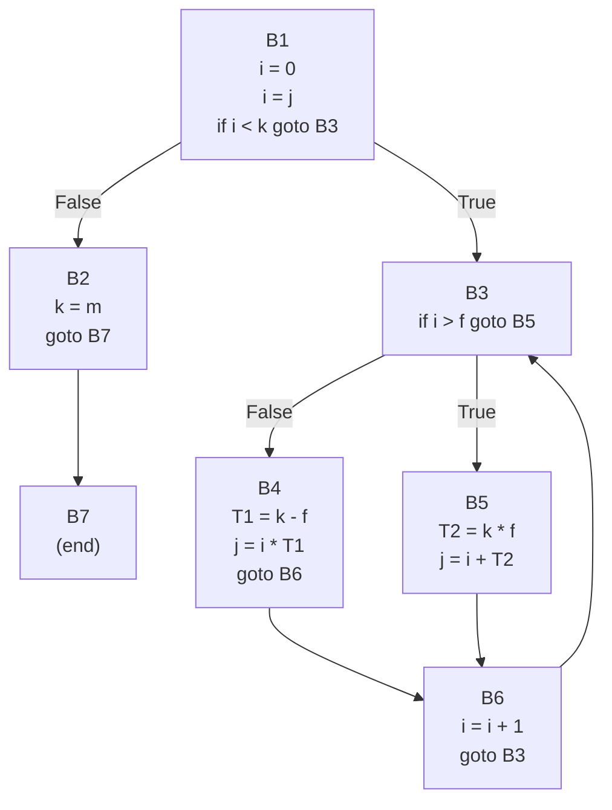

# From Code to Graph: A Simple Guide to Compilers' Secret Language

Have you ever wondered what happens after you write a piece of code? How does a computer, which only understands simple on-and-off signals, make sense of complex loops and `if-else` statements? The answer lies in a series of translations, and one of the most important steps in that process is converting your code into something called **Three-Address Code (3AC)**.

Think of a compiler as a translator. It can't translate a complex novel from English directly into binary. Instead, it first translates the novel into a simpler, more structured language, and *then* translates that simple language into the final machine code. Three-Address Code is that simple, structured language.

In this guide, we'll walk through this entire process. We'll start with a piece of C-like code, manually convert it into 3AC, and then use that to build a visual roadmap of our program called a **Control-Flow Graph (CFG)**.

## Part 1: What is Three-Address Code?

Three-Address Code is an intermediate representation of your code that breaks down every single action into a simple, one-line instruction. The "three-address" name comes from the most common format, which looks like this:

`result = operand1 op operand2`

For example: `A = B + C`

Here, we have three "addresses" or locations: `B` and `C` are the inputs, and `A` is the output where the result is stored. The golden rule of 3AC is that **each instruction can perform at most one operation**.

### The Rules of the Game

To keep things simple and predictable, 3AC follows a few strict formats.

1.  **The Main Event: `A = B op C`**
    This is for binary operations like addition, subtraction, multiplication, and division. A complex expression like `j = i + k * f` isn't allowed in a single step. You have to break it down. To do this, we use temporary variables (like `T1`, `T2`, etc.) to hold intermediate results.

      * `T1 = k * f`
      * `j = i + T1`

2.  **Simple Copying: `A = B`**
    This is just a straightforward assignment, like `i = j`.

3.  **One-Sided Operations: `A = op B`**
    This is for unary operations, where you only need one operand, like negation (`A = -B`).

4.  **Jumping Around: `goto L`**
    This is an unconditional jump. It tells the program to stop executing in sequence and immediately jump to the instruction at label `L`.

5.  **Conditional Jumps: `if condition goto L`**
    This is the foundation of loops and `if` statements. The program checks a condition, and if it's true, it jumps to label `L`. The key constraint here is that the `condition` can only involve **two variables**. An expression like `if i > f goto L` is valid, but `if a > b AND c < d` is not and must be broken down.

## Part 2: Let's Convert Some Code\! (A Walkthrough)

Let's take this piece of C-like code and convert it into 3AC step-by-step.

```c
i = 0;

for (i=j; i < k; i++) {

  if (i > f) {
    j = i + k * f;
  } else {
    j = i * (k - f);
  }
}

k = m;
```

Our goal is to create a list of simple, numbered instructions. For now, where we need to jump, we'll use a placeholder like `[NextStep]` and fill in the actual line number later.

1.  **Initial Setup:** We start with the lines outside and before the loop.

      * `i = 0`
      * `i = j` (This is the initialization part of the `for` loop).

2.  **The Loop Condition:** The `for` loop runs as long as `i < k`. We'll translate this into a conditional jump. If `i < k` is true, we jump into the loop's body. If it's false, we skip past the loop entirely.

      * `if i < k goto [LoopBody]`
      * If false, execution "falls through" to the next line. We'll add a `goto` to jump to the code that runs *after* the loop.
      * `goto [AfterLoop]`

3.  **The `if-else` Block inside the Loop:** This is the heart of the loop.

      * First, we check the condition `if (i > f)`. If it's true, we jump to the code for the `if` block.
          * `if i > f goto [IfBlock]`
      * If the condition is false, we execute the `else` block. Remember, `j = i * (k - f)` must be broken down.
          * `T1 = k - f`
          * `j = i * T1`
      * After the `else` block runs, we need to skip over the `if` block's code and go straight to the end of the loop iteration.
          * `goto [EndOfIteration]`
      * Now we write the code for the `if` block (at the `[IfBlock]` label). The expression `j = i + k * f` also needs to be decomposed.
          * `T2 = k * f`
          * `j = i + T2`

4.  **End of the Loop Iteration:** At the end of each loop run, we need to handle the `i++` part of the `for` loop and then jump back to the top to check the condition again.

      * `i = i + 1`
      * `goto [LoopCondition]` (This sends us back to repeat the loop)

5.  **After the Loop:** Finally, we have the code that runs once the loop is finished.

      * `k = m`

### Assembling and Numbering the Code

Now, let's put all those pieces together and assign line numbers (addresses) to each instruction. For simplicity, we'll assume every instruction has the same size and just increment the address by one each time.

With the numbers in place, we can replace our placeholders like `[LoopBody]` with the actual line numbers.

Here is the final, numbered Three-Address Code:

```
1:  i = 0
2:  i = j
3:  if i < k goto 6      // If true, jump to the loop body
4:  k = m                // This line only runs if the loop condition (line 3) is initially false
5:  goto 14              // Jump to the end of the program
6:  if i > f goto 10     // Start of loop body. Check the inner if-else condition
7:  T1 = k - f           // Else-block starts here
8:  j = i * T1
9:  goto 12              // Skip the if-block and go to the loop increment
10: T2 = k * f           // If-block starts here
11: j = i + T2
12: i = i + 1            // End of iteration: increment i
13: goto 3               // Jump back to the main loop condition
14: (end)
```

## Part 3: Visualizing the Flow with Basic Blocks

Our 3AC listing is correct, but it's hard to see the program's flow—the jumps make the path messy. To clean this up, we group the code into **Basic Blocks**.

A basic block is a straight-line sequence of code with no jumps in or out, except at the very beginning and very end.

Here are the rules for finding them:

1.  The first instruction in the code starts a block.
2.  Any instruction that is the **target of a jump** starts a new block.
3.  Any instruction immediately following a **jump** starts a new block.

Let's apply this to our 3AC:

  * **Line 1 (`i = 0`)** is the first instruction. It starts **Block 1**.
  * Block 1 continues until line 3, which is a jump.
  * **Line 4 (`k = m`)** comes after a jump, so it starts **Block 2**.
  * Block 2 ends with a jump at line 5.
  * **Line 6 (`if i > f...`)** is a target of the jump from line 3, so it starts **Block 3**.
  * Block 3 ends with a jump at line 6.
  * **Line 7 (`T1 = k - f`)** comes after a jump, so it starts **Block 4**.
  * Block 4 ends with a jump at line 9.
  * **Line 10 (`T2 = k * f`)** is a target of the jump from line 6, so it starts **Block 5**.
  * **Line 12 (`i = i + 1`)** is a target of the jump from line 9, so it starts **Block 6**.
  * Block 6 ends with a jump at line 13.
  * **Line 14 (`(end)`)** is a target of the jump from line 5, so it starts **Block 7**.

Here is our code, organized into Basic Blocks:

---

### Basic Blocks (Listed Form)

1. **B1**

   * Instructions:

     ```
     1: i = 0
     2: i = j
     3: if i < k goto B3
     ```
   * Description: Initial setup and loop entry check.

2. **B2**

   * Instructions:

     ```
     4: k = m
     5: goto B7
     ```
   * Description: Code that runs after the loop is done.

3. **B3**

   * Instructions:

     ```
     6: if i > f goto B5
     ```
   * Description: Loop body condition (`if-else` check).

4. **B4**

   * Instructions:

     ```
     7: T1 = k - f
     8: j = i * T1
     9: goto B6
     ```
   * Description: The `else` part of the inner branch.

5. **B5**

   * Instructions:

     ```
     10: T2 = k * f
     11: j = i + T2
     ```
   * Description: The `if` part of the inner branch.

6. **B6**

   * Instructions:

     ```
     12: i = i + 1
     13: goto B3
     ```
   * Description: Loop update and jump back to the loop condition.

7. **B7**

   * Instructions:

     ```
     14: (end)
     ```
   * Description: Exit point of the program.

___

## Part 4: Building the Control-Flow Graph (CFG)

Now for the final step\! A **Control-Flow Graph (CFG)** turns our Basic Blocks into a simple flowchart. Each block becomes a node (a box), and the jumps between them become edges (arrows).

  * Each Basic Block is a node.
  * If a block ends with a conditional jump (like `if...goto`), it will have two arrows pointing out: one for the "true" path and one for the "false" path (the fall-through).
  * If a block ends with an unconditional `goto`, it will have one arrow pointing to its target.

Based on our blocks, here is the resulting CFG:



This graph makes the program's logic instantly clear:

  * You can see the main loop as the cycle formed by **B3, B4, B5, and B6**.
  * You can see the `if-else` logic where **B3** splits into **B4** and **B5**, which then merge back together before hitting **B6**.
  * You can see the entry point (**B1**) and the single exit point (**B7**).

And that's it\! We've successfully taken a piece of human-readable code, translated it into the compiler's simple language (3AC), and then built a visual map of its execution path (the CFG). This intermediate process is what allows compilers to understand, analyze, and optimize our code before turning it into the machine instructions that power our software.
